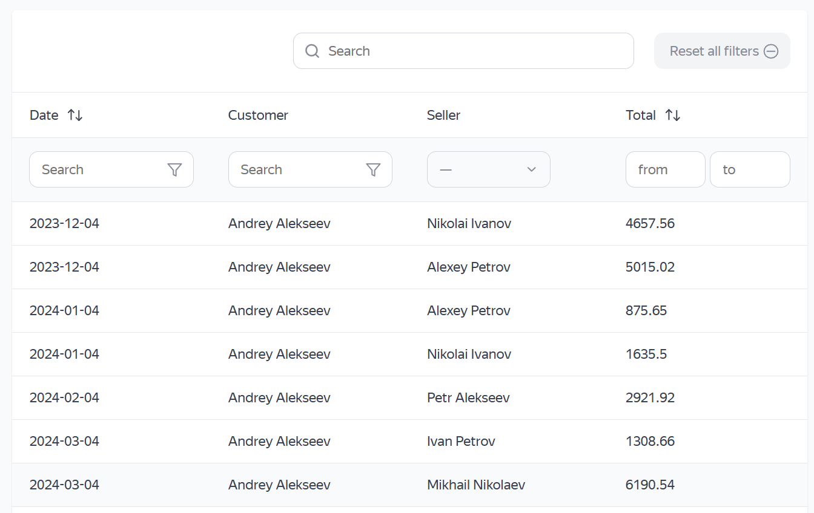

# sp6-2_smart-table_starter
## Smart table 
https://github.com/HelenVirtanen/smart-table

Интерактивная таблица для отображения данных о продажах с поддержкой:
* 🔍 поиска, 
* 🗂️ фильтрации, 
* 🔢 сортировки,
* 📄 пагинации. 

Проект построен с использованием Vite и модульной архитектуры JavaScript.

## 🖼️ Скриншот
 

## 🛠️ Используемые технологии
- **HTML / CSS** — разметка и стили таблицы
- **JavaScript** — логика приложения c модульной и и компонентной архитектурой
- **API** — получение данных через запросы на сервер
- **Vite** — сборка проекта

## 🚀 Установка и запуск
**Локально**
1. Клонируйте репозиторий:
   ```git clone https://github.com/HelenVirtanen/smart-table```
2. Перейдите в папку проекта:
   ```cd smart-table```
3. Установите зависимости: 
   ```npm i```
4. Запустите приложение:
   ```npm run dev```
   
Приложение будет доступно по адресу http://localhost:5173